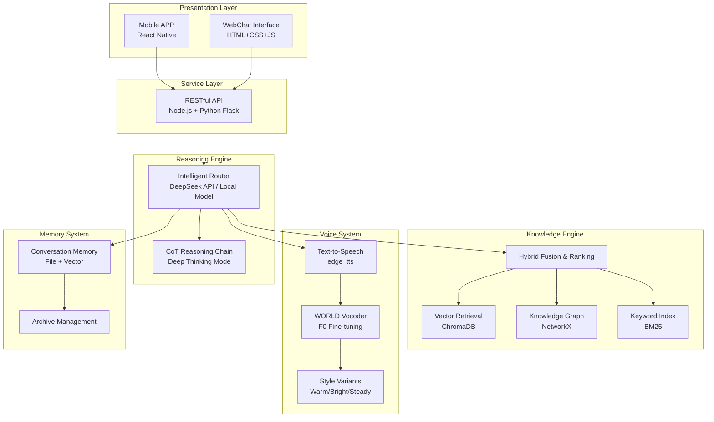
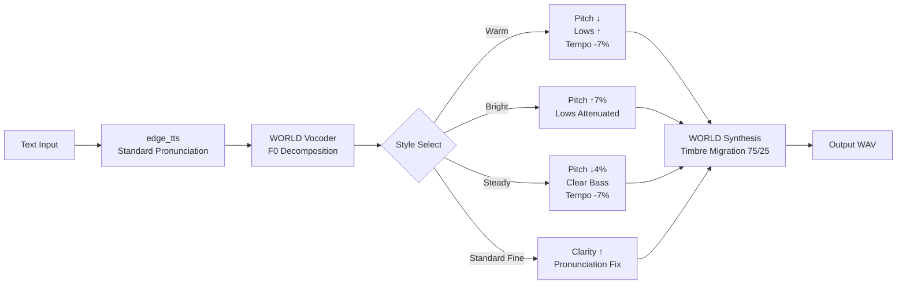

# MeU Architecture Guide

> Version: v0.0.2 | Last Updated: 2026-07-07

---

## 1. Overall Architecture

MeU adopts a **layered, decoupled architecture** where each module is developed and deployed independently, communicating via standardized APIs.



---

## 2. Three-Phase Roadmap

### Phase 1 · Symbiosis (Current → v1.0) 🤝

**You are here, your replica is here. Living together, shaping each other.**

| Milestone | Version | Goal |
|-----------|---------|------|
| Proof of Concept | v0.0.2 ✅ | Landing page + architecture docs + voice pipeline complete |
| Engine Ready | v0.1 | Knowledge engine deployable, first run example |
| Personal Customization | v0.3 | Support importing user memories, personality config |
| Digital Venture | v0.5 | Authorized replica executes independent tasks (info gathering, scheduling) |
| Stable Symbiosis | v1.0 | Full platform support (Web + Android + iOS) |

### Phase 2 · Immortality (v2.0+) 🌅

**After the host's passing, the replica persists independently.**

- Repository lifecycle management
- Self-sustaining mode (no host interaction required)
- Successor contact mechanism

### Phase 3 · Reincarnation (v3.0+) ♾️

**Memory transfer, new host takeover, cognitive framework iteration.**

- Standardized repository export/import format
- Multi-layer memory stacking (accumulation, not overwrite)
- Cross-generation cognitive fusion

---

## 3. Current Technical Architecture (v0.0.2)

### 3.1 Knowledge Engine (engine/)

Core retrieval pipeline — converting unstructured documents into structured knowledge.

```
User Input
    │
    ▼
┌─────────────────────┐
│  Entity Extractor    │  ← Extract named entities from input
└──────┬──────────────┘
       │
       ▼                    ┌────────────────┐
┌─────────────────────┐     │  Vector Search  │
│  Hybrid Router       │────▶│  ChromaDB       │
│                     │     └────────────────┘
│                     │     ┌────────────────┐
│                     │────▶│  BM25 Keywords  │
│                     │     └────────────────┘
│                     │     ┌────────────────┐
│                     │────▶│  Knowledge Graph│
│                     │     │  NetworkX       │
└──────┬──────────────┘     └────────────────┘
       │
       ▼
┌─────────────────────┐
│  Fusion Ranker       │  ← RRF fusion of triple results
└──────┬──────────────┘
       │
       ▼
   Reasoning Engine
```

**Technology Selection Rationale:**

| Component | Choice | Reason |
|-----------|--------|--------|
| Vector Store | ChromaDB | Lightweight, local-only, no external services, native Python |
| Knowledge Graph | NetworkX | Flexible non-linear reasoning, ideal for entity relationship modeling |
| Keyword Index | BM25 (custom) | Complementary to semantic search, zero cold-start latency |
| Embedding Model | all-MiniLM-L6-v2 (local) | Offline-capable, fast inference |

### 3.2 Reasoning Engine

**Multi-Model Intelligent Router Architecture:**

| Mode | Model | Use Case |
|------|-------|----------|
| Lightning | Local 1.5B | Quick response, offline, low power |
| Standard | DeepSeek API | Daily conversation, knowledge Q&A |
| Premium | DeepSeek API | Complex reasoning, long context |
| Reasoning | DeepSeek API + CoT | Deep thinking, logical analysis |

### 3.3 Voice System (Lijing-sound/)

**v4 Original Voice Fine-Tuning Pipeline:**



**Core Tool:** pyworld (WORLD Vocoder)
- F0 continuous pitch extraction & modification
- Spectral envelope (SP) analysis & reshaping
- Aperiodicity parameter (AP) analysis & adjustment
- Timbre migration: 75% original + 25% TTS output

---

## 4. Data Flow

```
User Input
    │
    ▼
┌──────────────┐    ┌──────────────┐    ┌──────────────┐
│ Presentation │───▶│  Service API  │───▶│  Reasoning    │
│ Web / App    │    │  Node/Flask  │    │  Engine       │
└──────────────┘    └──────────────┘    └──────┬───────┘
                                               │
                         ┌─────────────────────┼─────────────────────┐
                         ▼                     ▼                     ▼
                   ┌──────────┐         ┌──────────┐         ┌──────────┐
                   │ Knowledge│         │  Voice   │         │  Memory  │
                   │ Engine   │         │ TTS+WORLD│         │  System  │
                   │ (RAG)    │         │          │         │  History │
                   └──────────┘         └──────────┘         └──────────┘
                         │
                         ▼
                   ┌──────────┐
                   │ Response │
                   │ /Voice   │
                   └──────────┘
```

---

## 5. Directory Structure

```
E:\Project-Agent2025\MeU\              # Main development directory
│
├── engine/                            # Knowledge Engine (Python)
│   ├── main.py                        Main entry
│   ├── vector_store/                  ChromaDB vector storage
│   ├── knowledge_graph/               NetworkX knowledge graph
│   ├── hybrid_retriever/              Hybrid retrieval (vector+BM25+graph)
│   ├── entity_extractor/              Entity extraction
│   ├── bm25_indexer/                  BM25 keyword index
│   ├── ingestion/                     Document ingestion pipeline
│   ├── api/                           RESTful API (Flask)
│   └── start.bat                      Windows startup
│
├── Lijing-sound/                      # Voice System (Python)
│   ├── render_v4.py                   v4 original voice fine-tuning render
│   ├── render_v3.py                   v3 CSS animation video render
│   ├── world_demo_zh.py               WORLD Vocoder usage demo
│   └── styles/                        Style variant configs
│
├── server/                            # MeU Server (Node.js)
│
├── src/                               # MeU APP (React Native)
│
├── docs/                              # Documentation
│
├── config/                            # Config files (private, not public)
│
├── MeU-github/                        # GitHub release directory ← this repo
│   ├── index.html                     Landing Page (Chinese)
│   ├── index.en.html                  Landing Page (English)
│   ├── README.md                      Documentation (Chinese)
│   ├── README.en.md                   README (English)
│   ├── ARCHITECTURE.md                Architecture (Chinese)
│   ├── ARCHITECTURE.en.md             Architecture (English)
│   ├── LICENSE                        MIT License
│   └── .gitignore                     Ignore rules
│
└── webchat/                           WebChat interface
```

---

## 6. Security & Privacy

- **Local-first**: Core engine can run completely offline
- **Data sovereignty**: User memory data stored locally, not uploaded to cloud
- **Authorization**: Digital ventures require explicit, revocable permission
- **Encryption**: Repository encryption support (planned)

---

## 7. Technical Debt & Roadmap

| Item | Priority | Target Version |
|------|----------|----------------|
| First-run dependency installation test | High | v0.1 |
| Unit test coverage | High | v0.1 |
| Memory system semantic search enhancement | Medium | v0.2 |
| Auto-backup mechanism | Medium | v0.2 |
| Repository encryption | Low | v0.5 |

---

> **Born in architecture, forged in consulting, creating the future of AI applications.**
> MF-CubIC™
