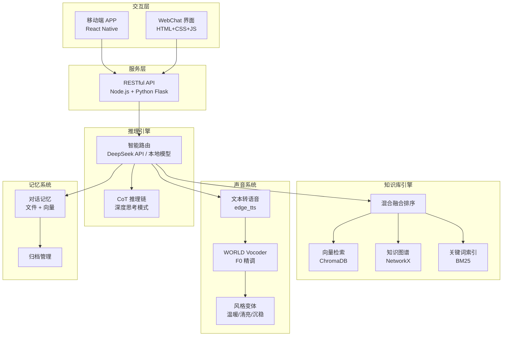
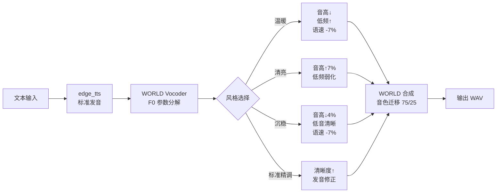

# MeU 架构说明

> 版本：v0.0.2 | 最后更新：2026-07-07

---

## 一、总体架构

MeU 采用**分层解耦架构**，各模块独立开发、独立部署，通过标准化 API 通信。



---

## 二、三阶段发展路线图

### 阶段一 · 共生期（当前 → v1.0）🤝

**你在，分身也在。朝夕相处，互相塑造。**

| 里程碑 | 版本 | 目标 |
|--------|------|------|
| 概念验证 | v0.0.2 ✅ | 宣传页面 + 架构文档 + 声音管线完成 |
| 引擎可用 | v0.1 | 知识库引擎部署运行，首次运行示例 |
| 个人定制 | v0.3 | 支持导入用户记忆、人格配置文件 |
| 数字出游 | v0.5 | 授权分身独立执行任务（信息收集、日程管理）|
| 稳定共生 | v1.0 | 全平台可用（Web + Android + iOS） |

### 阶段二 · 永生期（v2.0+）🌅

**宿主离世后，分身独立存续。**

- 仓库生命周期管理
- 自持运行模式（无需宿主交互）
- 继承者联络机制

### 阶段三 · 轮回期（v3.0+）♾️

**记忆移交、新宿主接管，认知框架迭代延续。**

- 仓库导出/导入标准格式
- 多层记忆叠加（非覆盖，而是累积）
- 跨代认知融合

---

## 三、当前技术架构（v0.0.2）

### 3.1 知识库引擎（engine/）

核心检索管线，实现从无序文档到结构化知识的转换。

```
用户输入
    │
    ▼
┌──────────────────┐
│  实体抽取器       │  ← 从输入中提取命名实体
│  Entity Extractor │
└──────┬───────────┘
       │
       ▼                    ┌──────────────┐
┌──────────────────┐        │  向量检索      │
│  混合检索路由     │───────▶│  ChromaDB     │
│  Hybrid Router   │        └──────────────┘
│                  │        ┌──────────────┐
│                  │───────▶│  关键词 BM25   │
│                  │        └──────────────┘
│                  │        ┌──────────────┐
│                  │───────▶│  知识图谱      │
│                  │        │  NetworkX     │
└──────┬───────────┘        └──────────────┘
       │
       ▼
┌──────────────────┐
│  融合排序         │  ← 三重结果 RRF 融合排序
│  Fusion Ranker   │
└──────┬───────────┘
       │
       ▼
   推理引擎
```

**技术选型理由：**

| 组件 | 选型 | 理由 |
|------|------|------|
| 向量存储 | ChromaDB | 轻量、本地部署、无需外部服务、Python 原生 |
| 知识图谱 | NetworkX | 灵活的非线性推理，适合实体关系建模 |
| 关键词索引 | BM25（自定义） | 语义检索的互补，冷启动无延迟 |
| 嵌入模型 | all-MiniLM-L6-v2（本地） | 离线可用，推理速度快 |

### 3.2 推理引擎

**多模型智能路由架构：**

| 模式 | 模型 | 适用场景 |
|------|------|----------|
| Lightning | 本地 1.5B | 快速响应、离线、低功耗 |
| Standard | DeepSeek API | 日常对话、知识问答 |
| Premium | DeepSeek API | 复杂推理、长上下文 |
| Reasoning | DeepSeek API + CoT | 深度思考、逻辑分析 |

### 3.3 声音系统（Lijing-sound/）

**v4 原声精调管线：**



**核心工具：** pyworld (WORLD Vocoder)
- F0 连续音高提取与修改
- 频谱包络 (SP) 分析与重塑
- 非周期性参数 (AP) 分析与调整
- 音色迁移：75% 原始音色 + 25% TTS 输出

---

## 四、数据流向

```
用户输入
    │
    ▼
┌────────────┐    ┌──────────────┐    ┌────────────┐
│  前端交互层  │───▶│  服务层 API   │───▶│  推理引擎    │
│ Web / App   │    │ Node/Flask   │    │  Router    │
└────────────┘    └──────────────┘    └─────┬──────┘
                                            │
                          ┌─────────────────┼─────────────────┐
                          ▼                 ▼                 ▼
                    ┌──────────┐     ┌──────────┐     ┌──────────┐
                    │ 知识库引擎 │     │ 声音系统  │     │ 记忆系统  │
                    │ RAG      │     │ TTS+WORLD│     │ 对话历史  │
                    └──────────┘     └──────────┘     └──────────┘
                          │
                          ▼
                    ┌──────────┐
                    │ 输出响应  │
                    │ 文本/语音 │
                    └──────────┘
```

---

## 五、目录结构

```
E:\Project-Agent2025\MeU\          # 开发主目录
│
├── engine/                        # 知识库引擎（Python）
│   ├── main.py                    主入口
│   ├── vector_store/              ChromaDB 向量存储
│   ├── knowledge_graph/           NetworkX 知识图谱
│   ├── hybrid_retriever/          混合检索 (向量+BM25+图谱)
│   ├── entity_extractor/          实体抽取
│   ├── bm25_indexer/              BM25 关键词索引
│   ├── ingestion/                 文档导入管线
│   ├── api/                       RESTful API (Flask)
│   └── start.bat                  Windows 启动
│
├── Lijing-sound/                  # 声音系统（Python）
│   ├── render_v4.py               v4 原声精调渲染
│   ├── render_v3.py               v3 CSS 动画视频渲染
│   ├── world_demo_zh.py           WORLD Vocoder 使用示例
│   └── styles/                    风格变体配置文件
│
├── server/                        # MeU 服务端（Node.js）
│
├── src/                           # MeU APP（React Native）
│
├── docs/                          # 项目文档
│
├── config/                        # 配置文件（私密，不公开）
│
├── MeU-github/                    # GitHub 发布目录 ← 本仓库
│   ├── index.html                 宣传页 · 中文
│   ├── index.en.html              Landing Page · English
│   ├── README.md                  说明文档 · 中文
│   ├── README.en.md               README · English
│   ├── ARCHITECTURE.md            架构说明 · 中文
│   ├── ARCHITECTURE.en.md         Architecture · English
│   ├── LICENSE                    MIT License
│   └── .gitignore                 忽略规则
│
└── webchat/                       WebChat 交互界面
```

---

## 六、安全与隐私

- **本地优先**：核心引擎可在完全离线环境下运行
- **数据主权**：用户记忆数据存储在本地仓库，不上传云端
- **授权机制**：数字出游需显式授权，每次授权可撤销
- **仓库加密**：用户数据仓库支持加密存储（规划中）

---

## 七、技术债务与待改进

| 项目 | 优先级 | 计划版本 |
|------|--------|----------|
| 引擎首运行安装依赖测试 | 高 | v0.1 |
| 单元测试覆盖 | 高 | v0.1 |
| 记忆系统语义搜索增强 | 中 | v0.2 |
| 自动备份机制 | 中 | v0.2 |
| 仓库加密 | 低 | v0.5 |

---

> **始于建筑，成于咨询，共创 AI 应用未来。**
> 铭方咨询 · MF-CubIC™
